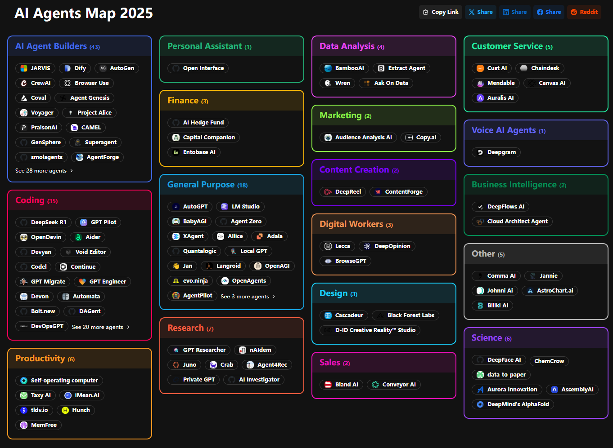

# AI Agent 技术版图研究报告

## 引言

本报告旨在对当前主流和前沿的AI Agent（人工智能智能体）相关开源项目进行一次全面的梳理和分析。通过对各项目的架构、设计理念和核心功能进行深度解读，我们将这些项目划分到不同的类别中，绘制出一幅宏观的AI Agent技术版图（Landscape）。同时，报告将对比各类别的代表性项目，并最终提出一套工程化的融合落地建议，为开发者在选择和应用这些技术时提供清晰的导览和参考。

## 一. AI Agent 技术版图与多维度分类

经过对十余个高质量项目的分析，我们识别出AI Agent技术栈中的不同层次，并将其归纳为以下六大类别。这六个类别从底层的基础设施到顶层的特定应用，构成了一个相对完整生态系统。

<table>
<tr>
<td width="56%">

</td>
<td width="50%">

</td>
</tr>
</table>

* https://aiagentsdirectory.com/category/ai-agents-frameworks
* https://aiagentslist.com/ai-agents-map
---

### **类别一：Agent应用开发框架 (Application Frameworks)**

这类框架是AI Agent生态系统的核心，它们提供了构建智能体（Agent）本身所需的核心抽象和脚手架。开发者基于这些框架，可以定义Agent的角色、能力、记忆和协作方式。它们是构建复杂、定制化Agent应用的基础。

- **代表项目**: `MetaGPT`, `AutoGen`, `crewAI`, `AgentScope`, `Agno`, `AutoAgent`, `Owl`, `agents`
- **核心特征**:
    - 提供`Agent`、`Role`或类似的核心抽象类。
    - 封装了与大语言模型（LLM）的交互逻辑。
    - 提供工具（Tools）注册和管理机制。
    - 内置了多智能体协作（Multi-Agent Collaboration）的编排模式。

---

### **类别二：编排与控制流框架 (Orchestration & Control Flow)**

这类框架专注于解决"如何执行"的问题。它们不一定提供"Agent"的现成抽象，而是提供更底层的、用于定义和运行复杂、有状态、可能包含循环的工作流的引擎。它们是Agent决策逻辑的"操作系统"。

- **代表项目**: `LangGraph`
- **核心特征**:
    - 将程序建模为图（Graph）。
    - 原生支持循环（Cycles），这对于Agent的"思考-行动"循环至关重要。
    - 强大的状态管理（State Management）和持久化（Checkpointing）机制。
    - 节点（Node）可以是任意可调用对象，如LLM调用或工具执行。

---

### **类别三：Agent开发平台 (Development Platforms)**

这类项目超越了单纯的代码框架，提供了一个包含前端UI、后端服务、数据库在内的、完整的、端到端的解决方案。它们的目标是降低Agent应用的开发和管理门槛，通常提供"开箱即用"的体验。

- **代表项目**: `AutoGPT`, `Magentic UI`, `Agent Zero`
- **核心特征**:
    - **全栈解决方案**: 通常包含前后端、数据库等组件。
    - **UI驱动**: 提供图形化界面，用于构建、测试、监控和管理Agent。
    - **托管与部署**: 关注Agent的托管和部署问题。
    - **预置能力**: 通常会内置一些强大的、开箱即用的Agent能力（如网页浏览、代码执行）。

---

### **类别四：专用智能体/应用 (Specialized Agents/Applications)**

这类项目是为解决特定任务而构建的、完整的、可直接运行的Agent应用。它们本身就是一个"产品"，而不是用于构建其他应用的"工具箱"。

- **代表项目**: `WebAgent`, `OpenDeepSearch`, `AgenticSeek`
- **核心特征**:
    - **任务导向**: 目标明确，为解决某一特定领域问题而设计（如深度网页问答、自动化研究）。
    - **端到端实现**: 提供了从接收输入到产生最终输出的完整流程。
    - **可直接使用**: 用户可以直接运行该应用来完成特定任务。
    - **（通常）基于某个框架构建**: 它们本身通常会使用类别一或类别二的框架来实现。

---

### **类别五：Agent基础设施与协议 (Infrastructure & Protocols)**_

这类项目处于技术栈的更底层，它们不关心Agent的具体实现，而是为Agent之间的交互和Agent与外部世界的连接提供标准化的"管道"和"插座"。

- **代表项目**: `A2A (Agent-to-Agent Protocol)`, `MCP (Model Context Protocol)`
- **核心特征**:
    - **定义标准**: 关注于定义通信协议或工具接口标准。
    - **互操作性**: 旨在让不同技术、不同平台构建的Agent或工具能够互相通信和协作。
    - **微服务架构**: 倾向于将Agent或工具实现为独立的、可通过网络访问的服务。

---

### **类别六：Agent API客户端库 (Agent API Client Libraries)**

这类库是特定Agent后端服务（尤其是商业化API）的客户端封装。它们为开发者提供了一套符合人体工程学的API，以便在代码中方便地使用这些后端服务。

- **代表项目**: `openai-agents-python`, `adk-python (Google AI)`
- **核心特征**:
    - **后端绑定**: 紧密耦合于一个特定的后端服务（如OpenAI Assistants API, Google AI Platform）。
    - **状态在后端**: Agent的状态（如对话历史）通常由后端服务管理，客户端库主要负责发起请求和处理响应。
    - **简化交互**: 将直接的HTTP API调用封装成更易于使用的Python对象和方法。

## 二. 各类别代表性项目介绍与对比

### 2.1 Agent应用开发框架

| 项目 | 核心理念/范式 | 协作模式 | 优点 | 缺点 |
| --- | --- | --- | --- | --- |
| **MetaGPT** | **SOP驱动** (标准作业程序) | **基于结构化产物的异步协作**。角色（如产品经理）生成文档，后续角色（如工程师）基于文档工作。 | 极度结构化，适合需要高质量、规范化输出的复杂任务（如软件开发），流程可预测。 | 灵活性较低，不适合探索性或需要动态调整流程的任务。 |
| **AutoGen** | **多智能体对话** | **基于对话的同步/异步协作**。通过精心设计的"群聊"和对话管理器来协调Agent。 | 极高的灵活性，善于处理需要多个不同视角"头脑风暴"的复杂问题。 | 对话管理和流程控制可能变得复杂，结果的确定性较低。 |
| **crewAI** | **角色扮演的任务流** | **基于任务依赖的协作**。通过定义`Agent`、`Task`和`Crew`，将任务分配给特定角色的Agent，按顺序或分层执行。 | 概念清晰，易于上手。声明式的API使得构建线性的、角色明确的团队非常直观。 | 流程模式相对固定（顺序/分层），对于需要复杂动态路由的场景支持较弱。 |
| **AgentScope** | **全栈与分布式** | **基于`MsgHub`（发布/订阅）的事件驱动协作**。为大规模、分布式的Agent系统设计。 | 功能全面，从底层RPC到上层UI都有覆盖，原生支持分布式部署，扩展性强。 | 学习曲线较陡，对于简单应用可能过于重型。 |

### 2.2 编排与控制流框架

`LangGraph` 是此类别的开创者和典型代表。

- **核心优势**: 它将LangChain的能力从线性的链（Chain）扩展到了任意结构的图（Graph）。其对**循环**的原生支持，完美地契合了Agent"思考->行动->观察->再思考"的核心循环。其`StateGraph`和`Channels`机制为管理复杂Agent状态提供了前所未有的强大能力。
- **与应用框架的关系**: `LangGraph`可以作为`AutoGen`或`crewAI`等框架的底层执行引擎。例如，你可以用`crewAI`定义角色和任务，然后用`LangGraph`来定义一个比`sequential`或`hierarchical`更复杂的、包含条件分支和循环的任务执行图。

### 2.3 Agent开发平台

`AutoGPT`、`Magentic UI` 和 `Agent Zero` 都提供了开箱即用的体验，但其侧重点和架构哲学有所不同。

-   **AutoGPT**: 更像一个**产品化**的社区平台，它定义了一套完整的"Agent即图"的工作流，并提供市场让用户分享。它的目标是让非开发者也能方便地构建和运行Agent。
-   **Magentic UI**: 更像一个面向**开发者和研究者**的"前沿工作台"。它基于`autogen`构建，提供了非常强大的预置Agent（如多模态的`WebSurfer`），并集成了评估框架，侧重于对前沿Agent能力的探索和验证。
-   **Agent Zero**: 则是一个**高度工程化的Agent工作站**。它最大的特点是**容器化优先**的架构，通过Docker提供了极其简单可靠的部署体验。其内置的**MCP（Master Control Program）协议**，实现了工具与智能体核心的解耦，甚至支持将工具分布式部署，在架构上极具前瞻性。它在易用性、稳定性和架构的先进性上取得了很好的平衡，适合需要稳定可靠、同时又具备高扩展性的个人或团队使用。

### 2.4 专用智能体/应用

- **WebAgent vs OpenDeepSearch**:
    - 两者都专注于网页信息的获取与问答，但实现路径不同。
    - `WebAgent` 采用**"探索者-提取者-评判者"**的责任链模式，模拟人类在网站上"点击-阅读-思考"的导航过程，更擅长处理需要跨多个页面跳转才能找到答案的任务。
    - `OpenDeepSearch` 则采用**"搜索-抓取-页内重排"**的深度RAG流程，它不进行复杂的导航，而是致力于将搜索引擎返回的几个顶层页面的信息"榨干吃透"，通过语义重排技术提取最高质量的信息片段，更擅长于对一个或少数几个信息源进行深度挖掘。

### 2.5 基础设施与客户端库

- **A2A / MCP**: 这类协议为实现一个开放的、去中心化的Agent生态提供了蓝图。一个遵循`A2A`协议的`AutoGen`团队，未来将可能调用另一个遵循同样协议的`crewAI`团队所提供的服务。`MCP`则为这些Agent安全地使用本地文件、Git等工具提供了标准接口。**`Agent Zero`项目内置的"Master Control Program"就是该理念的一个优秀实现**，它通过RPC方式将工具执行与Agent核心解耦。
- **openai-agents-python / adk-python**: 它们是构建在特定商业生态（OpenAI/Google）之上的"官方SDK"。选择它们意味着可以无缝使用对应厂商最先进的模型和托管托管（如代码解释器），但也会带来一定的厂商绑定。

## 三. 工程化落地【融合】建议

单一的框架或项目往往难以覆盖所有真实世界的复杂需求。一个务实且强大的工程化方案，应该是**分层解耦、各取所长**的融合架构。

**建议的融合架构方案：**

```mermaid
graph TD
    subgraph "表示与交互层 (UI & API)"
        U["用户界面<br/>(Gradio/Streamlit/Next.js)"]
        A["API网关<br/>(FastAPI)"]
    end

    subgraph "核心业务与编排层 (Orchestration)"
        LG["<b>LangGraph: 状态与流程引擎</b><br/>定义核心业务逻辑的有向循环图"]
    end

    subgraph "Agent能力实现层 (Application Frameworks)"
        direction LR
        AG["<b>AutoGen</b><br/>用于需要<br/>&quot;头脑风暴&quot;的<br/>复杂决策节点"]
        CW["<b>crewAI</b><br/>用于角色明确的<br/>线性任务执行节点"]
        MG["<b>MetaGPT</b><br/>用于需要生成<br/>高度结构化<br/>产物的节点"]
    end

    subgraph "专用工具层 (Specialized Tools)"
        direction LR
        W["<b>WebAgent / OpenDeepSearch</b><br/>作为可被调用的<br/>&quot;网页研究&quot;工具"]
        CT["自定义业务工具<br/>(数据库查询, 内部API调用等)"]
    end
    
    subgraph "底层基础设施 (Infrastructure)"
        MCP["<b>MCP-Server</b><br/>提供安全的本地<br/>文件/代码执行服务"]
        A2A["<b>A2A Protocol</b><br/>(可选) 用于未来<br/>跨团队/跨系统<br/>Agent服务调用"]
    end

    U --> A
    A --> LG

    LG -- "在图中调用节点" --> AG
    LG -- "在图中调用节点" --> CW
    LG -- "在图中调用节点" --> MG
    
    AG -- "使用工具" --> W
    CW -- "使用工具" --> CT
    MG -- "使用工具" --> MCP
    AG -- "使用工具" --> MCP

    subgraph "legend [图例]"
        direction TB
        L1("核心选择")
        L2("可选/根据场景引入")
    end

```

**方案解读：**

1.  **以 `LangGraph` 为核心骨架**：使用 `LangGraph` 作为最核心的业务流程编排和状态管理引擎。真实世界的业务不是单一Agent能完成的，它是一个复杂的、有状态的、包含条件分支和循环的流程。`LangGraph` 的图模型是描述这种流程的最佳选择。

2.  **用 "应用框架" 实现图节点**：`LangGraph` 中的每个节点（Node）的具体实现，可以来自不同的应用框架，各取所长：
    -   当某个节点需要**多个不同视角的AI进行"头脑风暴"**来做决策时，这个节点内部就运行一个 `AutoGen` 的多智能体对话。
    -   当某个节点是一个**角色明确、步骤清晰的线性任务**时（例如"数据分析师"拿到数据后，依次执行"清洗->分析->可视化"），这个节点内部就运行一个 `crewAI`。
    -   当某个节点需要**生成高度规范化的产物**（如一份完整的测试报告或一份API文档）时，可以调用一个 `MetaGPT` 的工作流。

3.  **将 "专用Agent" 工具化**：将 `WebAgent` 或 `OpenDeepSearch` 这样的专用Agent，封装成一个简单的函数或工具。当任何应用框架中的Agent需要进行深度网页研究时，直接调用这个工具即可，无需关心其内部复杂的实现。

4.  **用 "基础设施" 保障安全与互通**：
    -   对于需要访问本地文件系统或执行代码的Agent（如`AutoGen`中的`UserProxyAgent`或`crewAI`中的代码执行工具），其底层应通过 `MCP-Server` 提供的沙箱化、标准化的接口来执行，确保安全可控。
    -   `A2A` 协议可作为未来的扩展方向，用于实现跨系统、跨组织的Agent服务化调用。

**结论**：

通过这种分层融合的架构，我们可以构建一个既有`LangGraph`的流程控制力和状态管理能力，又能享受`AutoGen`、`crewAI`等框架带来的高效Agent开发体验，同时还能利用`WebAgent`等专用Agent的强大能力，并由`MCP`等基础设施保证其安全性的、高度灵活、可扩展且强大的AI Agent应用。这套架构为企业如何从琳琅满目的开源项目中取其精华、构建真正能解决复杂业务问题的工程化Agent系统，提供了一套可行的路线图。
