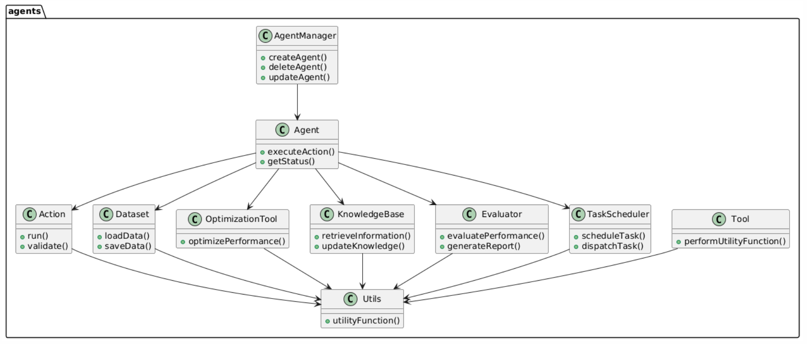
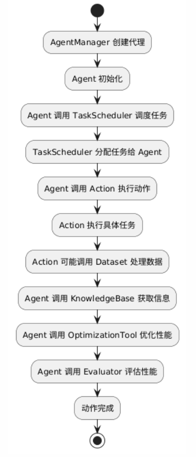

## 0. 简介

### 项目主要特点
- **背景**：`@agents` 项目旨在提供一个灵活且高效的代理管理系统，支持多种类型的代理操作与管理，适用于各种自动化任务和数据处理场景。
- **目标**：通过模块化设计，实现易于扩展和维护的代理框架，满足不同业务需求的多样化代理功能。
- **主要功能**：
  - **代理管理**：创建、删除、更新和查询代理实例。
  - **动作执行**：支持多种代理动作的定义与执行，如数据抓取、任务调度等。
  - **数据集成**：与多种数据源集成，支持数据的输入与输出。
  - **优化管理**：提供代理性能优化工具，提升系统效率。
  - **知识库管理**：集成多种知识库，支持智能决策和信息检索。
  - **评估模块**：对代理的性能和效果进行评估和分析。
  - **工具与实用程序**：提供各种辅助工具，简化开发和运维流程。
  - **扩展性**：提供插件机制，允许用户根据需求扩展新功能。

## 1. 项目的架构设计

### 1.1. 系统整体架构
`@agents` 项目采用模块化架构，主要由以下几个核心部分组成：
- **Agents 模块**：负责代理的创建与管理，包括代理的生命周期管理。
- **Actions 模块**：定义和执行代理的具体操作，如任务执行、数据处理等。
- **Datasets 模块**：处理与数据相关的操作，包括数据的读取、写入和转换。
- **Optimization 模块**：提供代理性能优化工具，提升系统效率。
- **Knowledge Bases 模块**：集成多种知识库，支持智能决策和信息检索。
- **Evaluation 模块**：对代理的性能和效果进行评估和分析。
- **Task 模块**：管理代理的任务调度与分配。
- **Tools 模块**：提供各种辅助工具，简化开发和运维流程。
- **Utils 模块**：提供通用的实用程序和工具函数，支持其他模块的功能实现。
- **基础设施**：提供通用的工具和服务，如日志系统、配置管理等。

### 1.2. 核心包的类图设计

```plantuml
@startuml
package agents {
    class AgentManager {
        +createAgent()
        +deleteAgent()
        +updateAgent()
    }

    class Agent {
        +executeAction()
        +getStatus()
    }

    class Action {
        +run()
        +validate()
    }

    class Dataset {
        +loadData()
        +saveData()
    }

    class OptimizationTool {
        +optimizePerformance()
    }

    class KnowledgeBase {
        +retrieveInformation()
        +updateKnowledge()
    }

    class Evaluator {
        +evaluatePerformance()
        +generateReport()
    }

    class TaskScheduler {
        +scheduleTask()
        +dispatchTask()
    }

    class Tool {
        +performUtilityFunction()
    }

    class Utils {
        +utilityFunction()
    }

    AgentManager --> Agent
    Agent --> Action
    Agent --> Dataset
    Agent --> TaskScheduler
    Agent --> KnowledgeBase
    Agent --> Evaluator
    Agent --> OptimizationTool
    Action --> Utils
    Dataset --> Utils
    OptimizationTool --> Utils
    KnowledgeBase --> Utils
    Evaluator --> Utils
    TaskScheduler --> Utils
    Tool --> Utils
}
@enduml
```

### 1.3. 核心模块
- **Agents 模块**：
  - **功能与定位**：负责代理的生命周期管理，包括创建、删除、更新和查询代理实例。
  - **交互方式**：通过 `AgentManager` 类与其他模块交互，管理不同类型的代理。
  - **依赖关系**：依赖 `Actions`、`Datasets`、`Task`、`Knowledge Bases`、`Evaluation` 和 `Optimization` 模块，以实现代理的具体功能。

- **Actions 模块**：
  - **功能与定位**：定义代理可执行的具体动作，如任务调度、数据处理等。
  - **交互方式**：与 `Agent` 类交互，执行代理指定的动作。
  - **依赖关系**：依赖 `Utils` 模块，支持复杂的动作逻辑。

- **Datasets 模块**：
  - **功能与定位**：处理数据的输入与输出，包括数据的加载、保存和转换。
  - **交互方式**：由 `Agent` 类调用，用于支持代理的动作执行。
  - **依赖关系**：依赖 `Utils` 模块，与数据库或外部数据源集成，确保数据的可靠性和一致性。

- **Optimization 模块**：
  - **功能与定位**：提供代理性能优化工具，提升系统效率。
  - **交互方式**：由 `Agent` 类调用，优化代理的执行性能。
  - **依赖关系**：依赖 `Utils` 模块，使用内部优化算法或第三方优化库。

- **Knowledge Bases 模块**：
  - **功能与定位**：集成多种知识库，支持智能决策和信息检索。
  - **交互方式**：由 `Agent` 类调用，提供知识支持和决策依据。
  - **依赖关系**：依赖 `Utils` 模块，与外部知识库系统集成。

- **Evaluation 模块**：
  - **功能与定位**：对代理的性能和效果进行评估和分析。
  - **交互方式**：由 `Agent` 类调用，提供性能评估和报告生成。
  - **依赖关系**：依赖 `Utils` 模块，使用统计分析和报告生成工具。

- **Task 模块**：
  - **功能与定位**：管理代理的任务调度与分配，确保任务的高效执行。
  - **交互方式**：与 `Agent` 和 `Actions` 模块交互，调度和分配具体任务。
  - **依赖关系**：依赖 `Utils` 模块，使用任务调度算法和工具。

- **Tools 模块**：
  - **功能与定位**：提供各种辅助工具，简化开发和运维流程，如日志管理、配置工具等。
  - **交互方式**：为其他模块提供工具支持，提升开发和运维效率。
  - **依赖关系**：依赖 `Utils` 模块，集成各种开发和运维工具。

- **Utils 模块**：
  - **功能与定位**：提供通用的实用程序和工具函数，支持其他模块的功能实现，如数据处理函数、日志工具等。
  - **交互方式**：被多个模块调用，提供基础支持功能。
  - **依赖关系**：独立模块，为整个系统提供基础工具支持。

#### 流程图

```plantuml
@startuml
start
:AgentManager 创建代理;
:Agent 初始化;
:Agent 调用 TaskScheduler 调度任务;
:TaskScheduler 分配任务给 Agent;
:Agent 调用 Action 执行动作;
:Action 执行具体任务;
:Action 可能调用 Dataset 处理数据;
:Agent 调用 KnowledgeBase 获取信息;
:Agent 调用 OptimizationTool 优化性能;
:Agent 调用 Evaluator 评估性能;
:动作完成;
stop
@enduml
```

## 2. 设计模式分析
`@agents` 项目中应用了多种设计模式，以提高系统的灵活性和可维护性：

- **工厂模式**：
  - **应用**：在 `AgentManager` 中用于创建不同类型的 `Agent` 实例。
  - **原因**：简化对象创建过程，支持扩展新类型的代理而无需修改现有代码。
  - **优缺点**：
    - 优点：解耦对象创建与使用，提高代码的可扩展性。
    - 缺点：增加了类的数量，可能导致代码复杂度增加。

- **策略模式**：
  - **应用**：在 `Actions` 模块中，允许不同的动作实现共享统一的接口。
  - **原因**：支持在运行时动态选择不同的动作逻辑，增强系统的灵活性。
  - **优缺点**：
    - 优点：提高了算法的可复用性和可替换性。
    - 缺点：客户端需要理解不同策略的存在，可能增加使用难度。

- **观察者模式**：
  - **应用**：用于代理状态变化的通知机制，允许不同模块监听代理的状态变化。
  - **原因**：实现模块之间的解耦，提高系统的响应能力。
  - **优缺点**：
    - 优点：模块间低耦合，易于扩展和维护。
    - 缺点：可能导致系统调试困难，因多观察者的存在。

- **单例模式**：
  - **应用**：在 `Utils` 模块中，确保某些工具类（如日志管理器）的唯一实例。
  - **原因**：避免创建多个实例导致资源浪费或状态不一致。
  - **优缺点**：
    - 优点：控制实例数量，节省资源。
    - 缺点：可能限制了系统的扩展性，增加了测试难度。

- **装饰器模式**：
  - **应用**：在 `Tools` 模块中，为现有功能动态添加新功能，例如日志记录、权限验证等。
  - **原因**：在不修改原有代码的情况下，增强功能模块的能力。
  - **优缺点**：
    - 优点：灵活性高，符合开闭原则。
    - 缺点：可能增加系统的复杂性，导致使用困难。

这些设计模式的应用使得 `@agents` 项目具有良好的扩展性和可维护性，但也需注意过度使用可能导致系统复杂度提升。

## 3. 项目亮点

- **模块化设计**：项目采用高度模块化的架构，使得各个功能模块之间解耦，便于独立开发和维护。
- **灵活的扩展机制**：通过工厂模式和策略模式，项目允许用户根据需求轻松扩展新类型的代理和动作。
- **丰富的日志系统**：集成了完善的日志记录机制，帮助开发者和运维人员快速定位和解决问题。
- **数据集成能力**：支持与多种数据源的集成，确保数据处理的灵活性和高效性。
- **优化工具集成**：内置性能优化工具，提升代理的执行效率和系统整体性能。
- **知识库支持**：集成多种知识库，增强代理的智能决策能力和信息检索效率。
- **评估与分析**：提供全面的性能评估模块，帮助开发者持续优化系统表现。
- **丰富的工具与实用程序**：提供多种开发和运维工具，简化流程，提升工作效率。
- **良好的文档支持**：提供详细的README和文档，降低了新用户的上手难度。

### 潜在的改进空间与建议
- **性能优化**：对于高并发场景，可能需要进一步优化代理的执行效率，减少资源消耗。
- **安全性增强**：在代理的创建与管理过程中，加入更严格的权限控制和安全验证机制。
- **测试覆盖率**：增加单元测试和集成测试的覆盖率，确保各模块的稳定性和可靠性。
- **用户界面**：开发更加友好的用户界面，提升用户体验，方便非技术用户进行代理管理。
- **文档完善**：进一步完善模块间的交互文档和使用指南，帮助开发者更好地理解和使用各模块功能。
- **扩展性提升**：优化插件机制，支持更灵活的第三方扩展，满足更多业务场景需求。

通过以上改进，`@agents` 项目将进一步提升其竞争力和应用价值。
